# Voting dApp using smart contract - Team7

## Phần 1: Setup dev environment

```text
dev env: wls2 ubuntu on windowns 11
IDE: VSCode
VSCode Extensions: Solidity, Prisma
NodeJs: lts 24 for ui using Next.js framework
```

## Phần 2: Kiến trúc tổng thể:

### Stack công nghệ và kiến trúc ứng dụng
```text
                      ┌───────────────────────────┐
                      │       Developer CLI       │
                      │  forge / anvil / cast     │
                      │  - build Voting.sol       │
                      │  - forge script deploy    │
                      └─────────────┬─────────────┘
                                    │  (deploy)
                                    v
                       RPC :8545  ┌───────────────┐
                      ┌─────────▶│   ANVIL EVM    │
                      │           │ (Local chain) │
                      │           │ - Voting SC   │
                      │           │ - Test accts  │
                      │           └───────┬───────┘
                      │                   ▲
                      │ JSON-RPC          │
                      │ via ethers.js     │
                      │                   │
┌─────────────────────┴───────────────────┴───────────────────────┐
│                        Browser (Client)                         │
│  - Next.js React UI (/login, /vote)                             │
│  - Talks to window.ethereum (MetaMask)                          │
│  - Uses ethers.js + NEXT_PUBLIC_BALLOT_ADDRESS                  │
│                                                                 │
│   Chair & Voter actions:                                        │
│     • Login (NextAuth)                                          │
│     • Chair: Start / End vote, Grant right                      │
│     • Voter: Vote for candidate                                 │
│                                                                 │
└───────────────┬───────────────────────────────┬─────────────────┘
                │ HTTP (Next.js API routes)     │
                │                               │
                v                               v
      ┌──────────────────┐              ┌──────────────────┐
      │  Next.js Server  │              │   MetaMask Ext   │
      │  - /api/auth     │<───────────▶│ - Accounts (PK)   │
      │  - /api/users    │   connect    │ - Sign tx        │
      │  - NextAuth      │              └──────────────────┘
      │  - Role checks   │
      └─────────┬────────┘
                │ Prisma ORM
                v
         ┌──────────────────┐
         │   PostgreSQL DB  │
         │  - users         │
         │  - roles (CHAIR, │
         │    VOTER, …)     │
         └──────────────────┘

```

### App main flow Design

```text
[Developer]
   ├─ forge build / anvil
   ├─ forge script DeployVoting.s.sol → deploy Voting.sol
   └─ Lấy địa chỉ contract → cấu hình NEXT_PUBLIC_BALLOT_ADDRESS

[Chair user]
   ├─ Login web app (NextAuth → Postgres)
   ├─ Kết nối MetaMask (Chair-Account = deployer)
   ├─ Start vote (tx → MetaMask → Anvil → Voting contract)
   └─ Grant quyền cho các địa chỉ voter

[Voter user]
   ├─ Login web app bằng account voter1@..., voter2@...
   ├─ Chọn MetaMask account tương ứng (Voter1-Account, …)
   ├─ Vote (tx → MetaMask → Anvil → Voting contract)
   └─ Xem kết quả (UI đọc dữ liệu từ contract)

[Chair]
   └─ End vote + Show winner (read từ Voting contract)

```

## Phần 3: Các bước triển khai ứng dụng

### Step 1: install foundry

```shell
# Download foundry installer `foundryup`
curl -L https://foundry.paradigm.xyz | bash
# Install forge, cast, anvil, chisel
foundryup

# check:
forge --version
anvil --version
```

### Step 2: Create Solidity project

```shell
forge init voting-foundry
cd voting-foundry

# code Voting.sol and DeployVoting.sol
```

### Step 3: build

```shell
forge clean
forge build
```
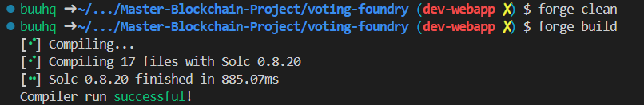

### Step 4: Start Envil

```shell
anvil
# or anvil &
# or anvil --port 8546 &
# copy 01 private key
```
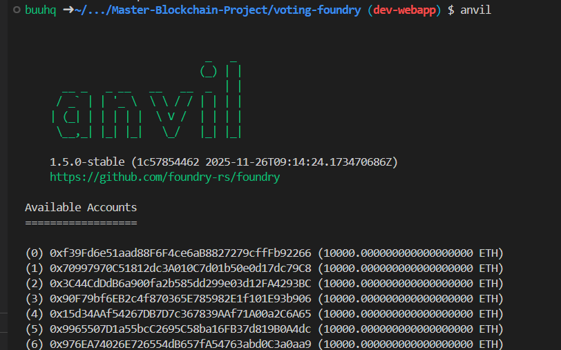

### Step 5: Deploy contract

```shell
export RPC_URL="http://127.0.0.1:8545"
export PRIVATE_KEY=0xac0974bec39a17e36ba4a6b4d238ff944bacb478cbed5efcae784d7bf4f2ff80

forge script script/DeployVoting.s.sol:DeployVoting \
  --rpc-url $RPC_URL \
  --private-key $PRIVATE_KEY \
  --broadcast

# copy Contract Address
# Lấy ABI & Contract Address cho Frontend: out/Voting.sol/Ballot.json

```
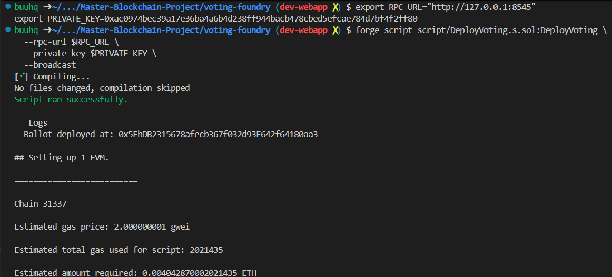


### Step 6: install MetaMask

```text
Install MetaMask chrome extension

# new network
# import contract
# import account (with private key)

```
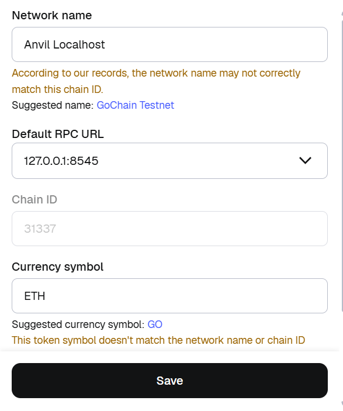

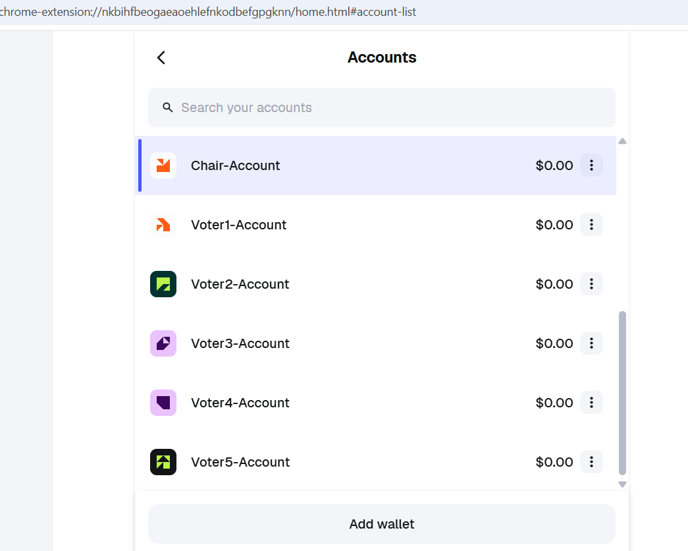

### Step 7: Create voting webapp project

```shell
npx create-next-app@latest voting-web \
  --typescript \
  --eslint \
  --tailwind

cd voting-web

npm install -D prisma@6.18.0
npm install @prisma/client@6.18.0

npx prisma migrate dev --name init
npx prisma generate

npm run seed

```

```shell
# project clone

cd voting-web
# install node lts 24.11.1

npm install

npx prisma migrate dev --name init
npx prisma generate

npm run seed
```

```shell
npm run dev
npm run dev -- --port 3001
```

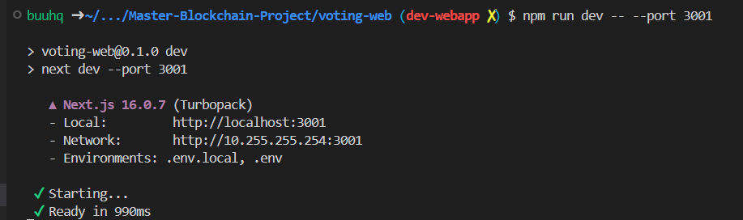

## Phần 4: Demo ứng dụng

Login chair:

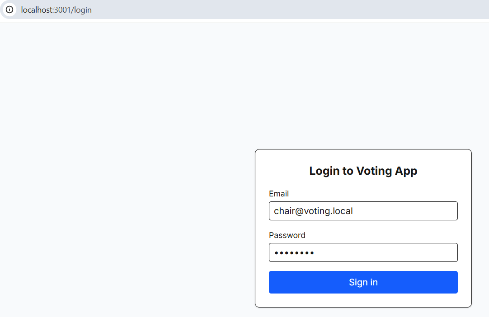

UI - Chair:

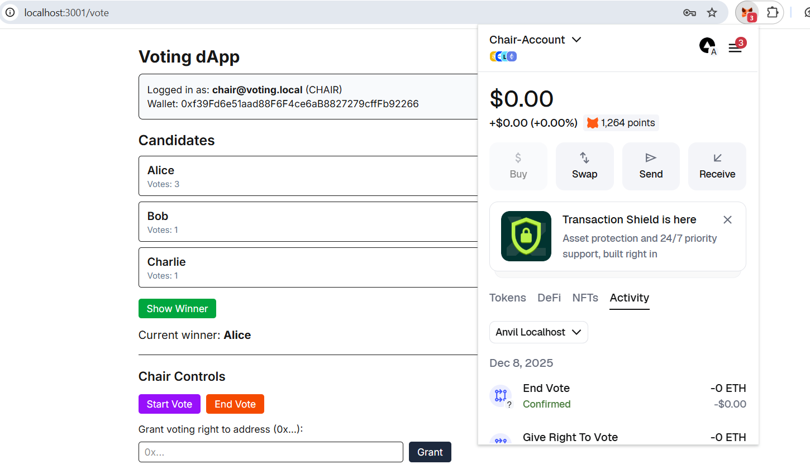

Chair Request:
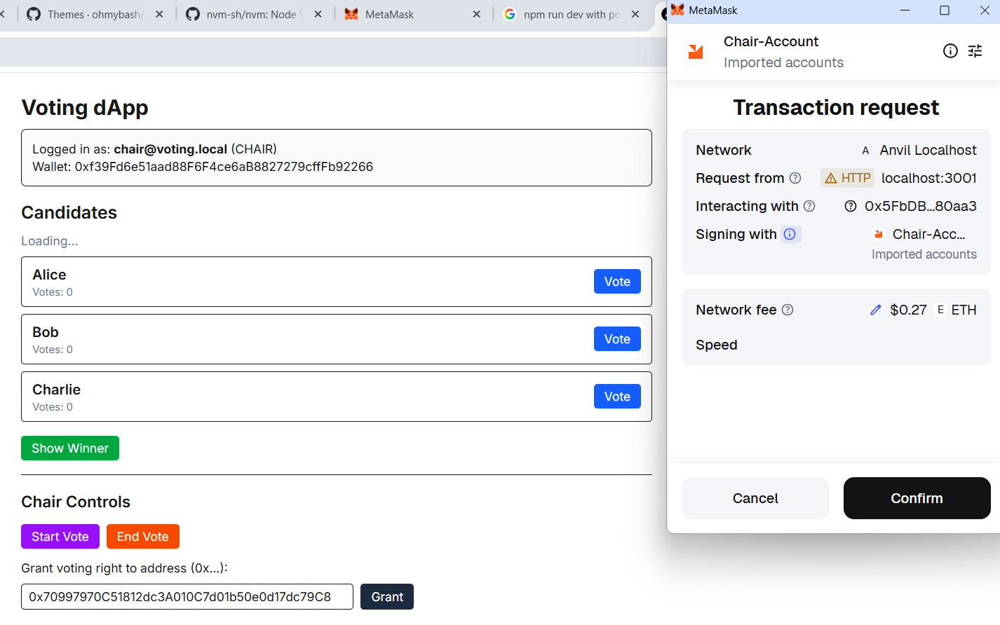


Login Voter (5):

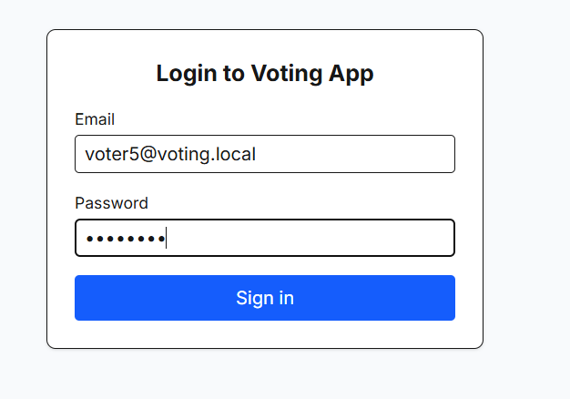

Voter Request:

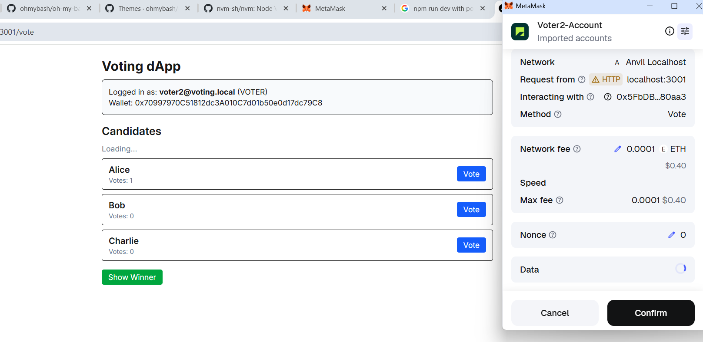

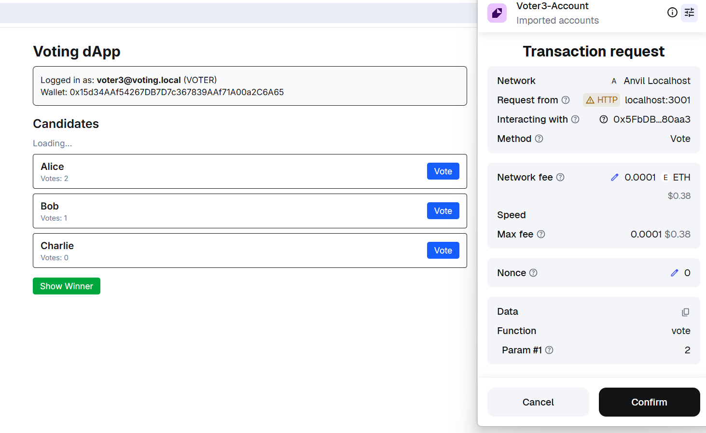

Voting Winner:

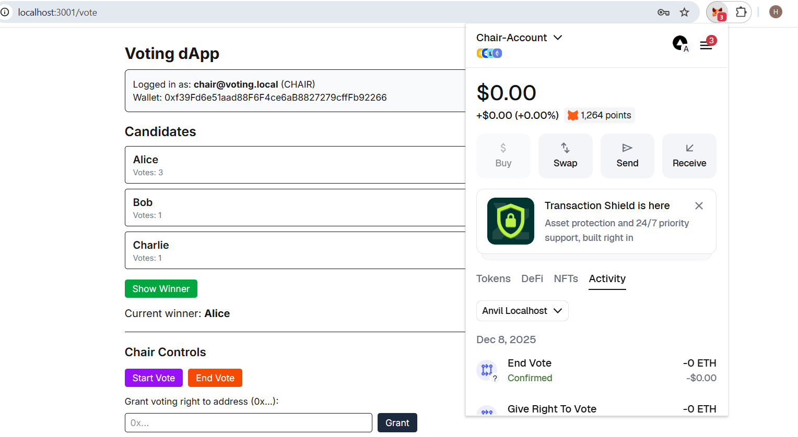